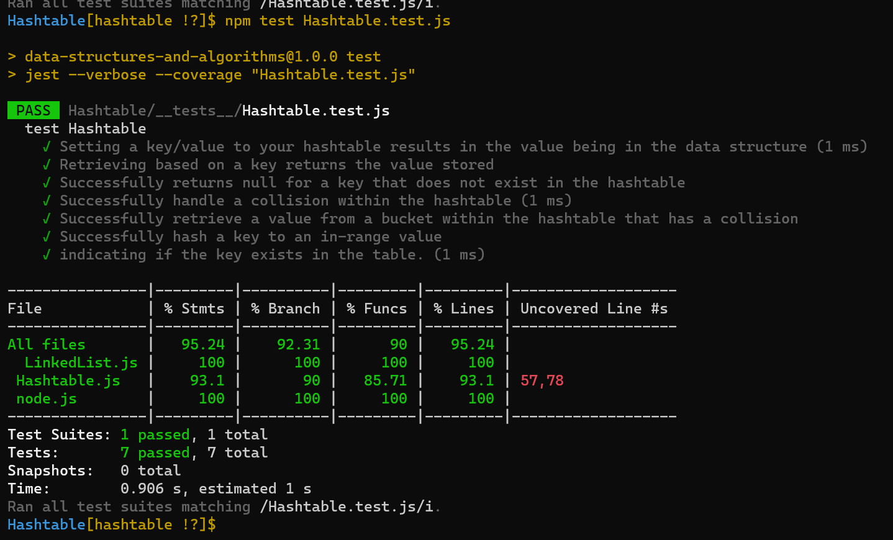

# Hashtables
Hashtables are a type of data structure that uses key-value pairs to store data. This means that each Node and Bucket has a key as well as a value.

## Challenge
Implement a Hashtable Class that have the  following methods:
+ set : space O(1) , Time O(1)
+ get : space O(1) , Time O(n)
+ contains : space O(1) , Time O(1)
+ keys : space O(1) , Time O(1)
+ hash : space O(1) , Time O(1)

## Approach & Efficiency
+ Time Complexity:
+ Average
  + Access N/A
  + Insertion O(1)
+ Worst
  + Access N/A
  + Insertion O(n)
+ Space Complexity:
  + O(n)

## API
<!-- Description of each method publicly available in each of your hashtable -->
+ set takes (key, value) as an arguments, return nothing and This method should hash the key, and set the key and value pair in the table, handling collisions as needed also it should give key already exist, replace its value from the value argument given to this method.
+ get take key as an argument, and return value associated with that key in the table.
+ contains take key as an argument, and return boolean, indicating if the key exists in the table already.
+ keys, return Collection of keys
+ hash, take key as an argument, and return Index in the collection for that key

