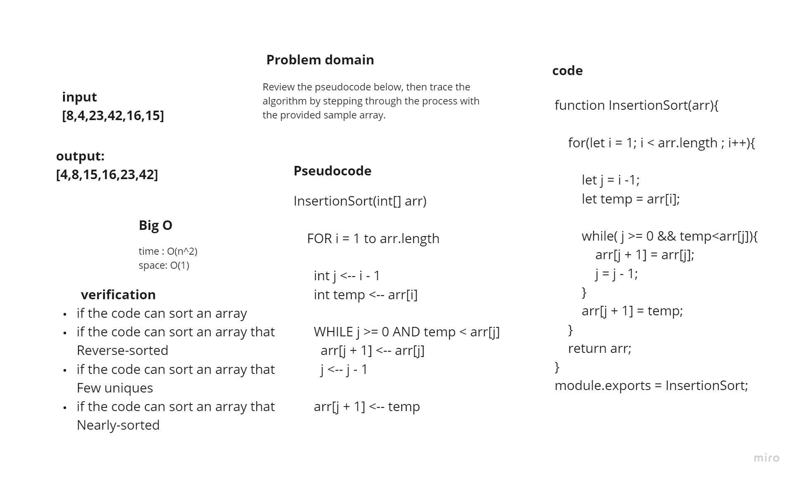
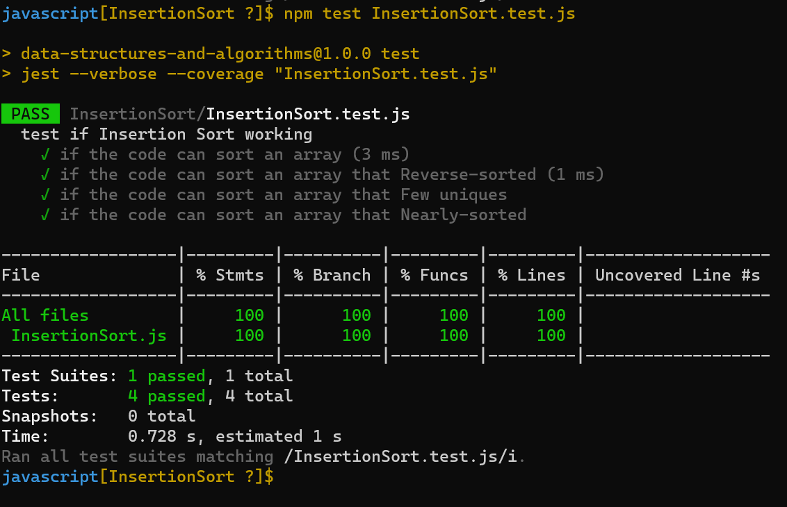

# Challenge Summary
Review the pseudocode below, then trace the algorithm by stepping through the process with the provided sample array.

## Whiteboard Process

## Approach & Efficiency

## Efficiency

+ Time Complexity
  + Best Case O(n)
  + Average Case O(n^2)
  + Worst Case O(n^2)

+ Space Complexity
  + Space Complexity O(1)

## Solution

## link to BLOG.md
[BLOG.md](./BLOG.md)
