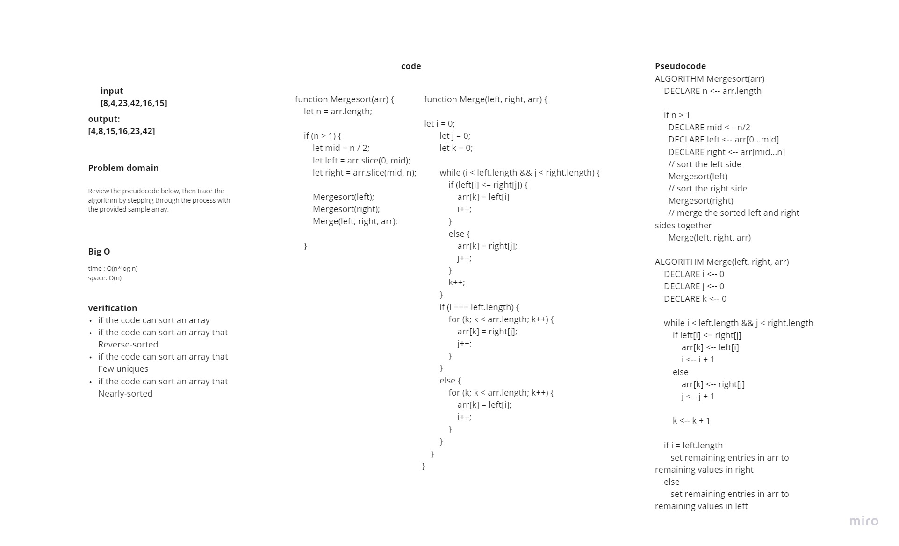
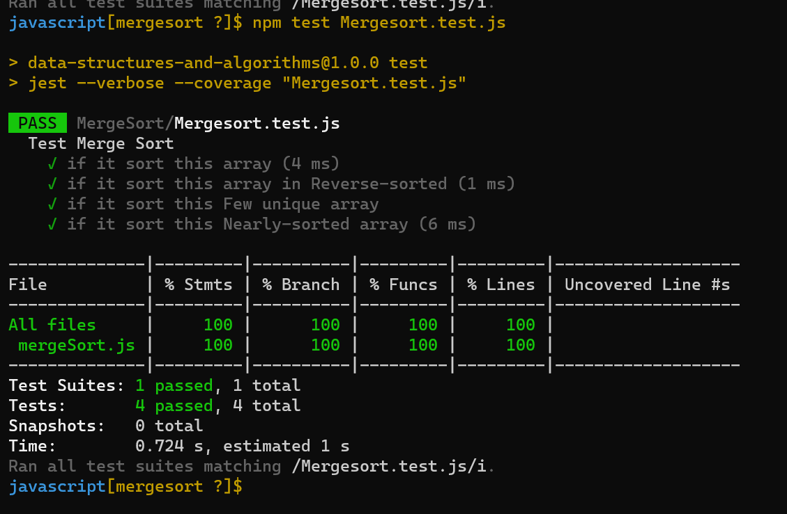

# Challenge Summary
Review the pseudocode below, then trace the algorithm by stepping through the process with the provided sample array. 

## Whiteboard Process

## Approach & Efficiency

+ Time Complexity
  + Best Case O(n*log n)
  + Average Case O(n*log n)
  + Worst Case O(n*log n)

+ Space Complexity
  + Space Complexity O(n)

## Solution
