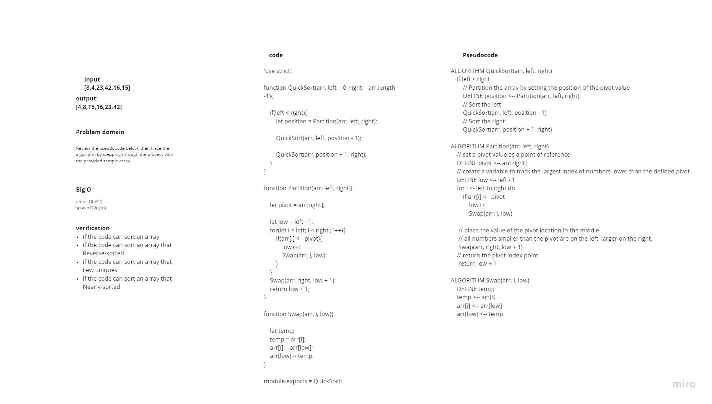
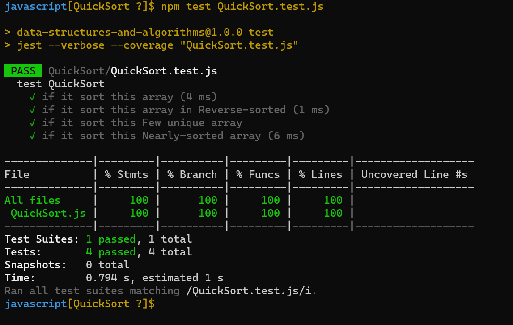

# Challenge Summary
Review the pseudocode below, then trace the algorithm by stepping through the process with the provided sample array. Document your explanation by creating a blog article that shows the step-by-step output after each iteration through some sort of visual.

## Whiteboard Process

## Approach & Efficiency

+ Time Complexity
  + Best Case O(n*log n)
  + Average Case O(n*log n)
  + Worst Case O(n^2)

+ Space Complexity
  + Space Complexity O(log n)

## Solution
<!-- Show how to run your code, and examples of it in action -->
