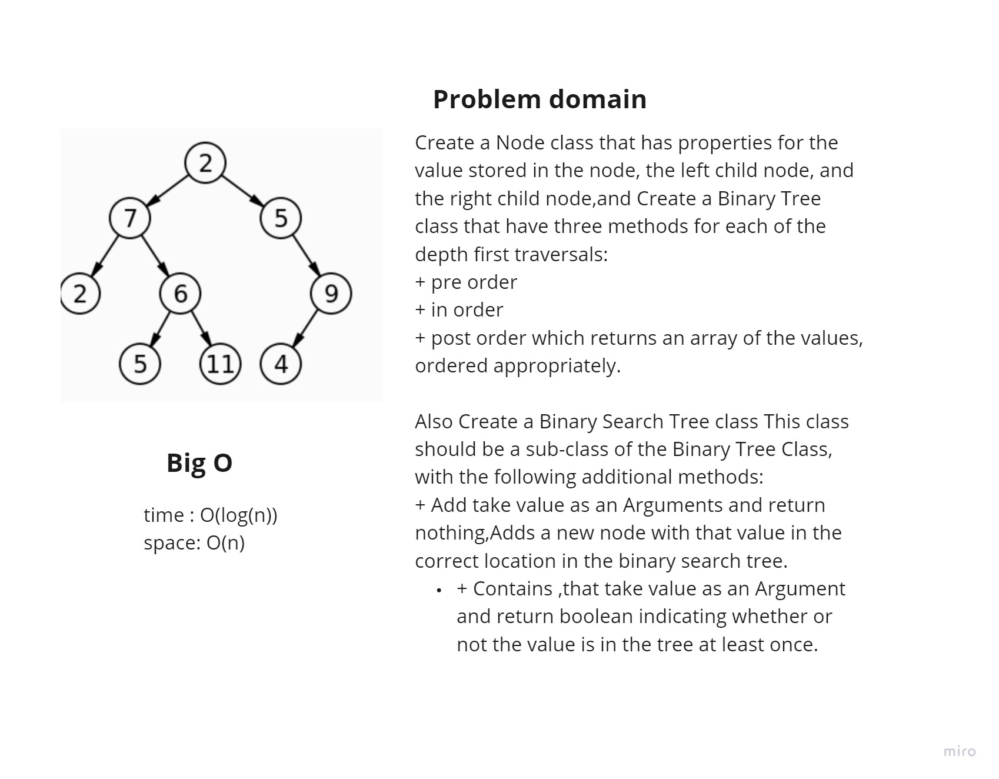

# Trees
A tree is a nonlinear data structure, compared to arrays, linked lists, stacks and queues which are linear data structures. A tree can be empty with no nodes or a tree is a structure consisting of one node called the root and zero or one or more subtrees.

## Challenge
Create a Node class that has properties for the value stored in the node, the left child node, and the right child node,and Create a Binary Tree class that have three methods for each of the depth first traversals:
+ pre order
+ in order
+ post order which returns an array of the values, ordered appropriately.

Also Create a Binary Search Tree class This class should be a sub-class of the Binary Tree Class, with the following additional methods:
+ Add take value as an Arguments and return nothing,Adds a new node with that value in the correct location in the binary search tree.
+ Contains ,that take value as an Argument and return boolean indicating whether or not the value is in the tree at least once.

## Approach & Efficiency
+ Time Complexity
  + Access: O(log(n))	
  + Search: O(log(n))
  + Insertion: O(log(n))
  + Deletion: O(log(n))
+ Space Complexity: O(n)
  

## API
+ Binary Tree class --> trees have three methods:
  + pre order
  + in order
  + post order which returns an array of the values, ordered appropriately.
+ Binary Search Tree
  + Add, Adds a new node with that value in the correct location in the binary search tree.
  + Contains,Returns: boolean indicating whether or not the value is in the tree at least once.

  ## whiteboard
  