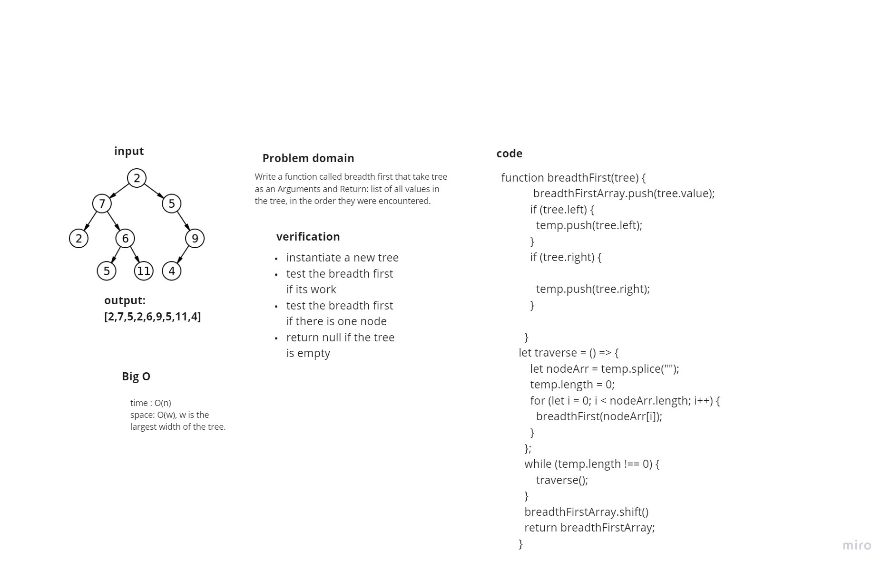
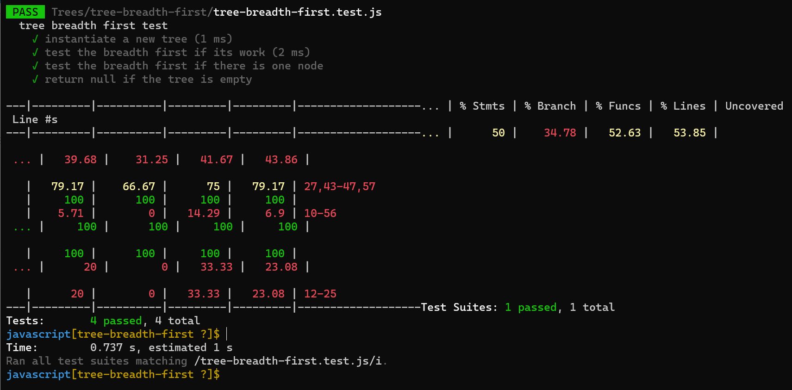

# Challenge Summary
Write a function called breadth first that take tree as an Arguments and Return: list of all values in the tree, in the order they were encountered.

## Whiteboard Process

## Approach & Efficiency

+ The Big O time complexity for inserting a new node is O(n)
+ The Big O space complexity for a node insertion using breadth first insertion will be O(w), where w is the largest width of the tree.

## Solution

