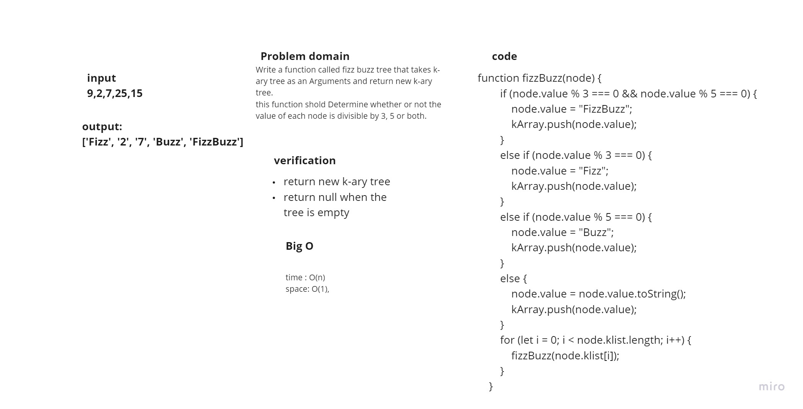
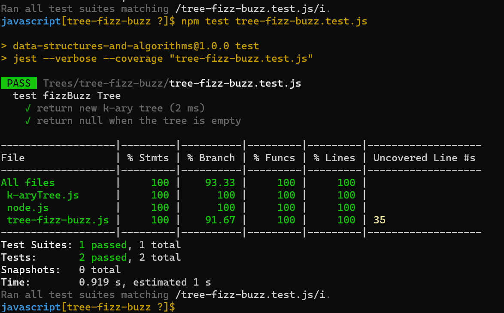

# Challenge Summary
Write a function called fizz buzz tree that takes k-ary tree as an Arguments and return new k-ary tree.
this function shold Determine whether or not the value of each node is divisible by 3, 5 or both.

## Whiteboard Process

## Approach & Efficiency
+ time : O(n)
+ space: O(1)

## Solution
