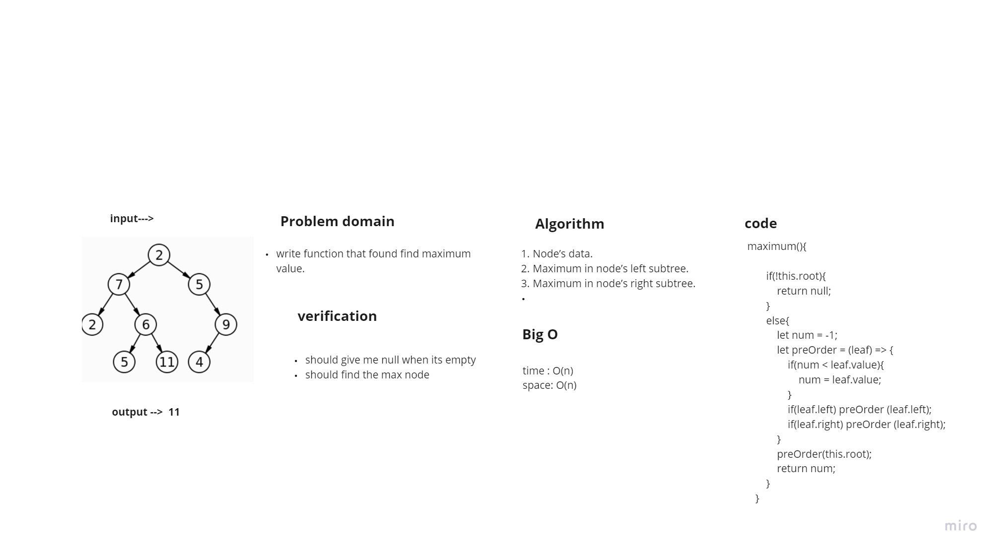
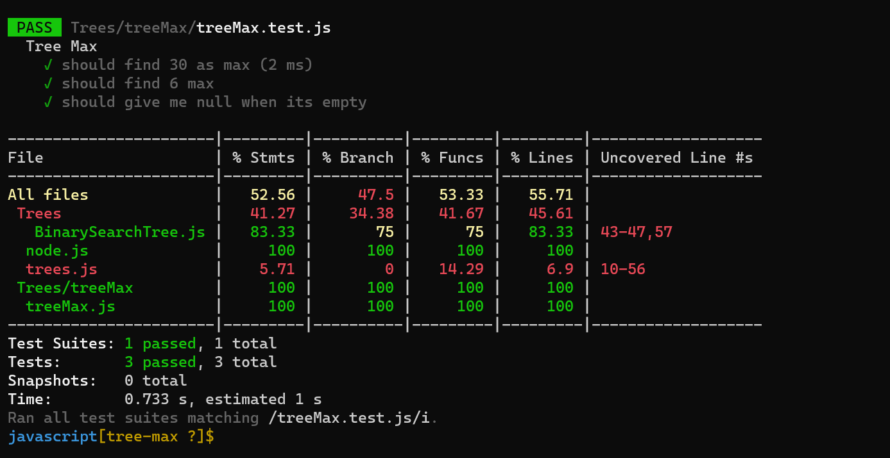

# Challenge Summary

write function that found find maximum value.

## Whiteboard Process

## Approach & Efficiency
+ Time Complexity: O(N),In the recursive function calls, every node of the tree is processed once and hence the complexity due to the function is O(N) if there are total N nodes in the tree. Therefore, the time complexity is O(N).
+ Space Complexity: O(N),Recursive call is happening. The every node is processed once and considering the stack space, the space complexity will be O(N). 

## Solution
