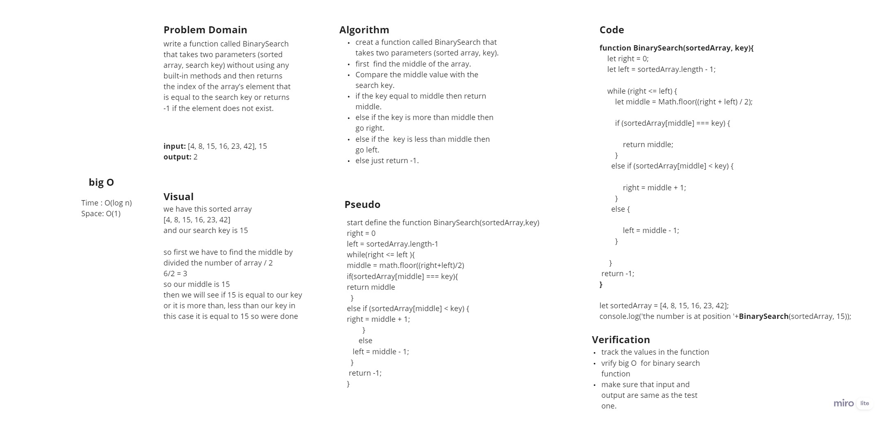

# Binary Search of Sorted Array

*write a function called BinarySearch that takes two parameters (sorted array, search key) without using any built-in methods and then returns the index of the array’s element that is equal to the search key or returns -1 if the element does not exist.*

## Whiteboard Process

## Approach & Efficiency
*We use divide and conquer algorithms in a Binary search and It is O(log n) for time Complexity*