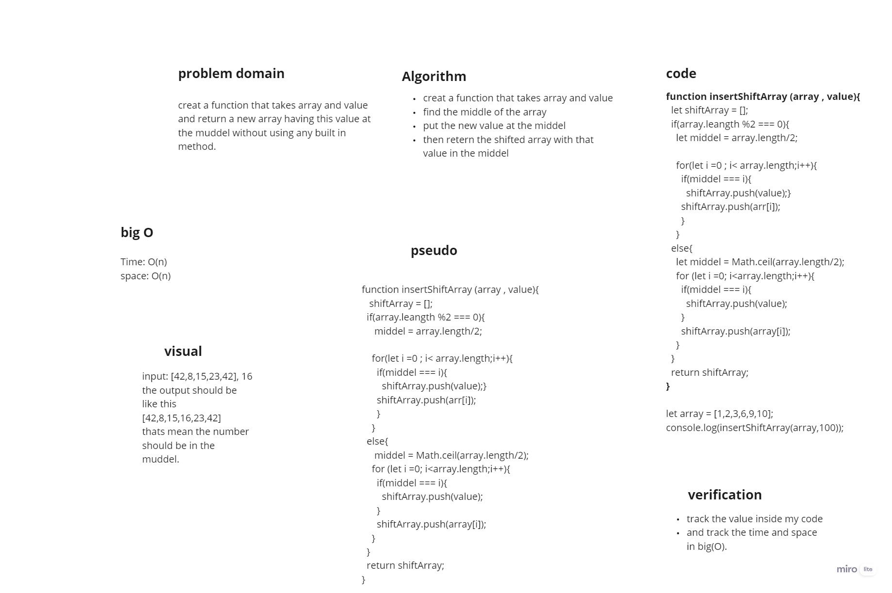

# Insert to Middle of an Array
<!-- Description of the challenge -->
*creat a function that takes array and value and return a new array having this value at the muddel without using any built in method.*

## Whiteboard Process
<!-- Embedded whiteboard image -->

## Approach & Efficiency

*this algorithm complexity for both time and space are O(n), this algorithm so helpfull when we need to add any thing in the middel but it will take time if the array were so big*