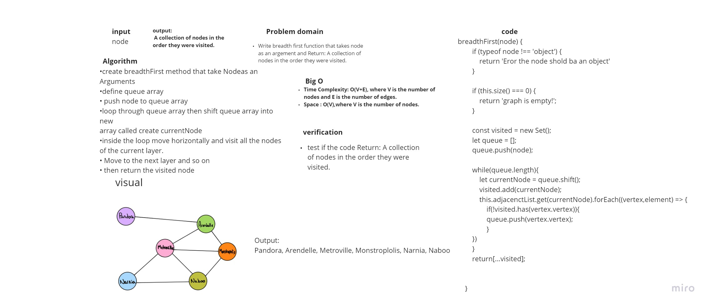
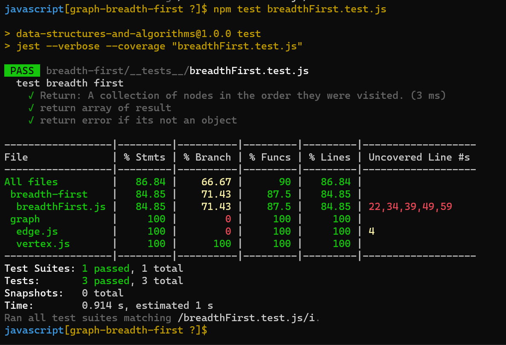

# Challenge Summary
Write breadth first function that takes node as an argement and return A collection of nodes in the order they were visited.

## Whiteboard Process

## Approach & Efficiency
+ Time Complexity: O(V+E), where V is the number of nodes and E is the number of edges.
+ Space : O(V),where V is the number of nodes.

## Solution
