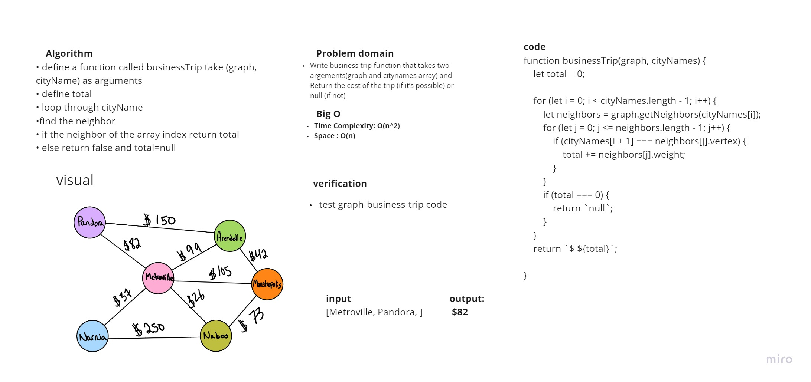
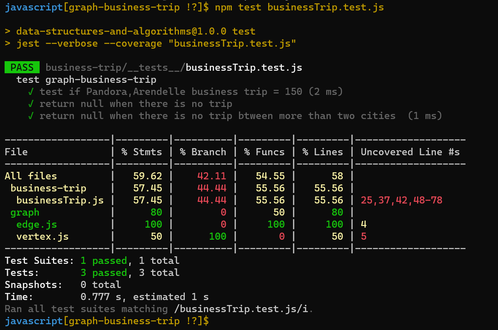

# Challenge Summary
Write business trip function that takes two argements(graph and citynames array) and Return the cost of the trip (if it’s possible) or null (if not)

## Whiteboard Process

## Approach & Efficiency
Time Complexity: O(n^2),where n=total number of cities.in the function we have two loops(nested loop) that wht the complexity will be O(n^2).
Space : O(n),n=total number of cities.

## Solution
