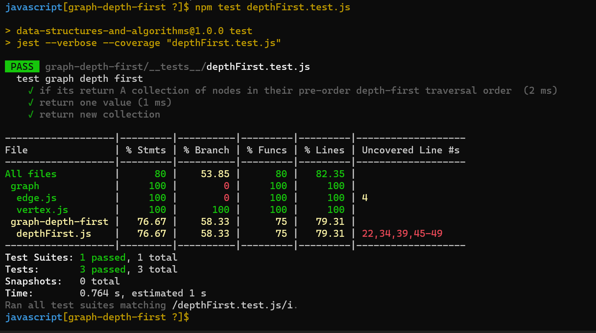
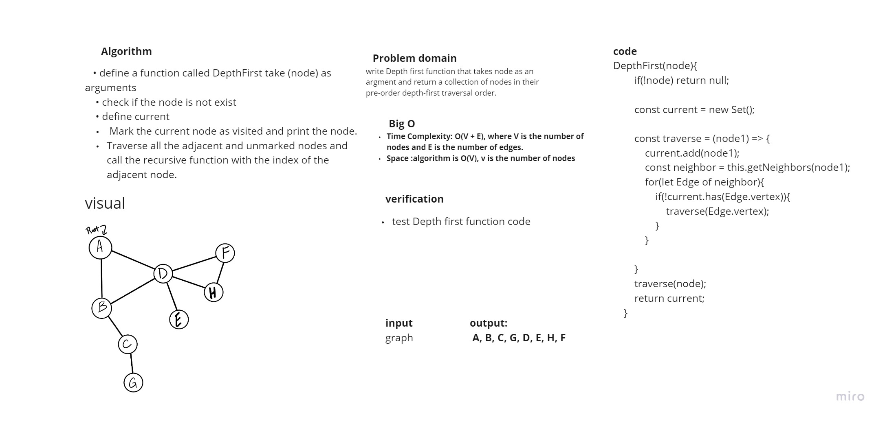

# Depth First Traversal
Depth First Search (DFS) algorithm traverses a graph in a depthward motion and uses a stack to remember to get the next vertex to start a search, when a dead end occurs in any iteration.

## Challenge
write Depth first function that takes node as an argment and return a collection of nodes in their pre-order depth-first traversal order.

## Approach & Efficiency
+ Time Complexity: O(V + E), where V is the number of nodes and E is the number of edges.
+ Space :algorithm is O(V), v is the number of nodes

## Solution

