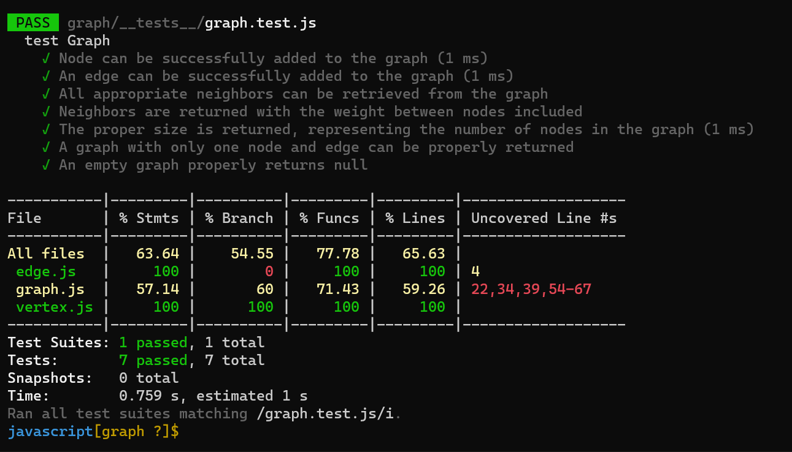

# Graphs
A graph is a non-linear data structure that can be looked at as a collection of vertices (or nodes) potentially connected by line segments named edges.

## Challenge
Implement your own Graph. The graph should be represented as an adjacency list, and should include the following methods:

+ add node
+ add edge
+ get nodes
+ get neighbors
+ size

## Approach & Efficiency
+ Time complexity
  + The sum of the sizes of the adjacency lists of all nodes in a directed graph is E. Thus, for a directed graph, the time complexity is O(V) + O(E) = O(V + E).
  + In an undirected graph, each edge appears twice. Once at either end of the adjacency list for the edge. Thus, in this case, the time complexity is O(V) + O (2E) ~ O(V + E).
  + To find all the neighboring nodes,Each row in an adjacency matrix corresponds to a node in the graph, and each row stores information about the edges that emerge from that node. As a result, in this situation, the time complexity of BFS is O(V * V) = O(V ^ 2).
+ Space complexity  
  + would take the size of the graph's nodes (or vertices) As a result, the space complexity is O (V).

## API
+ add node
  + Arguments: value
  + Returns: The added node
  + Add a node to the graph

+ add edge
  + Arguments: 2 nodes to be connected by the edge, weight 
  + Returns: nothing
  + Adds a new edge between two nodes in the graph
  + If specified, assign a weight to the edge
  + Both nodes should already be in the Graph

+ get nodes
  + Arguments: none
  + Returns all of the nodes in the graph as a collection

+ get neighbors
  + Arguments: node
  + Returns a collection of edges connected to the given node

+ size
  + Arguments: none
  + Returns the total number of nodes in the graph

