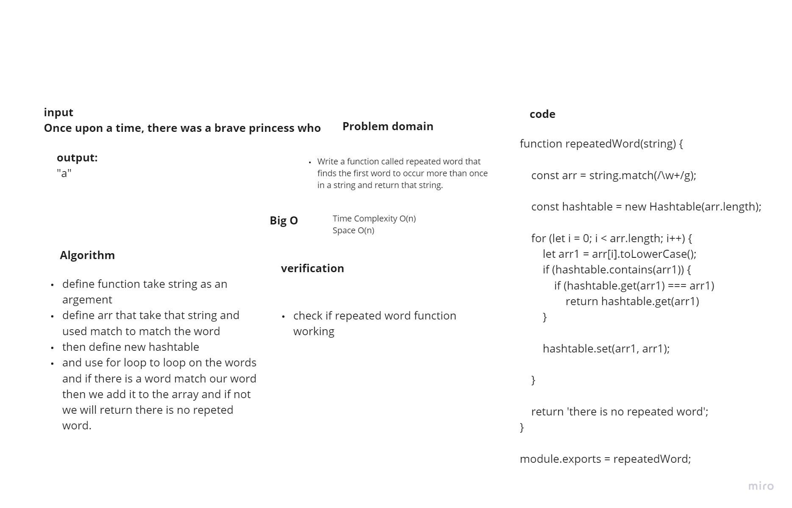

# Challenge Summary
Write a function called repeated word that finds the first word to occur more than once in a string and return that string.

## Whiteboard Process

## Approach & Efficiency
+ Time Complexity O(n)
+ Space O(n)

## Solution

