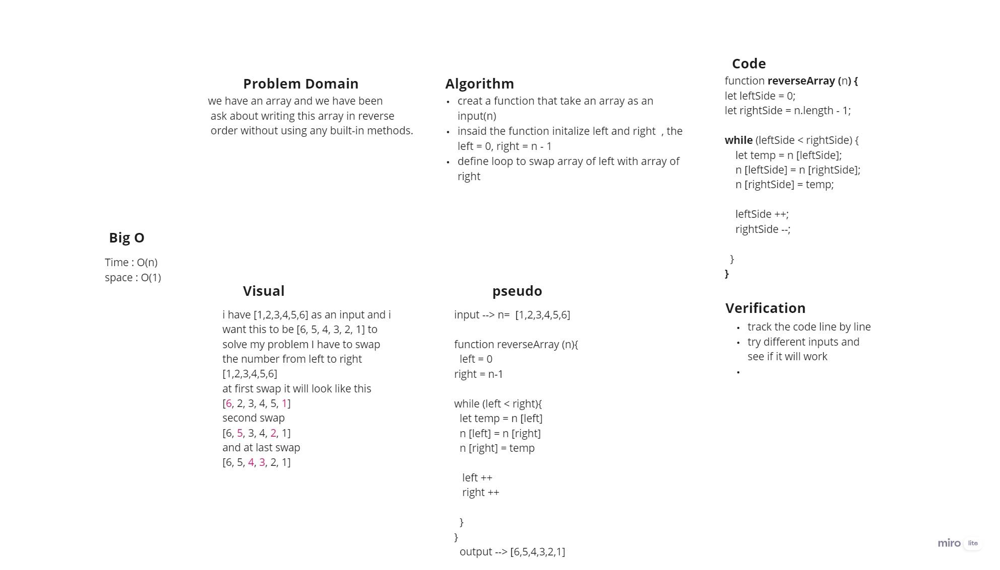

# Reverse an Array
*write function that reverse the array without using  using any built-in methods.*

## Whiteboard Process

## Approach & Efficiency
*i did follow the swap methode in this function so I can reverse the array*

*the big O here was Time: O(n) and space: O(1), I think its good if the array was nshort but if I have a big amount of number it will take O(n) time*