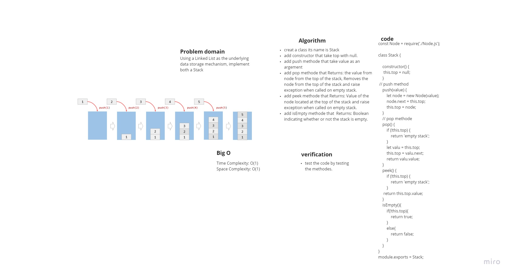
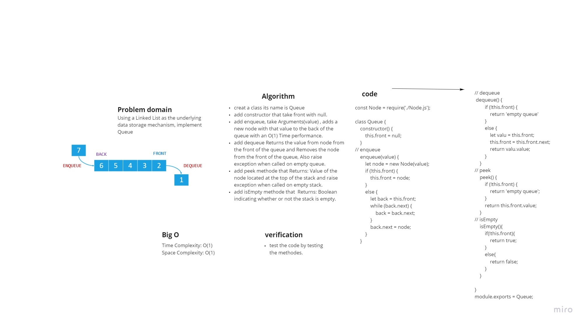

# Stacks and Queues
**Stack:** 
*A Node-based data structure is referred to as a stack. Each Node refers to the Node after it in the stack, but not to the one before it.*

**Queue:**
*A queue is a linear structure in which operations are carried out in a specific order.*

## Challenge
*using linked list to implement Stack and a Queue*

## Approach & Efficiency

### Stack
+ push O(1), It will always be an O(1) operation to push a Node into a stack. This is because no matter how many Nodes (n) you have on the stack, it takes the same amount of time.

+ pop O(1), The action of removing a Node from the top of a stack is known as popping a Node and it will be always O(1)

+ peek O(1), You will only inspect the top Node of the stack when doing a peek.

+ isEmpty O(1)

### Queue

+ Enqueue O(1),The enqueue operation is used to add an item to a queue. This is done with an O(1) time operation since it doesn't matter how many other items are in the queue (n); the operation takes the same amount of time.

+ dequeue O(1), The dequeue action is used to remove an item from a queue. This is an O(1) operation in terms of time because you are always removing the front Node of the queue, regardless of how many additional items are in the queue.

+ peek O(1), You will only inspect the top Node of the stack when doing a peek.

+ isEmpty O(1)

## API

**In stack and queue there is 8 methode:**
### stack: 
1. push, take Arguments(value) and adds a new node with that value to the top of the stack with an O(1) Time performance.
2. pop,that Returns: the value from node from the top of the stack, Removes the node from the top of the stack and raise exception when called on empty stack.

## Queue 
1. enqueue, take Arguments(value) , adds a new node with that value to the back of the queue with an O(1) Time performance.
2. dequeue, Returns the value from node from the front of the queue and Removes the node from the front of the queue, Also raise exception when called on empty queue.

## used at stack and queue
1. peek, Returns: Value of the node located at the top of the stack and raise exception when called on empty stack.
2. isEmpty, Returns: Boolean indicating whether or not the stack is empty.

## whiteboard

-----------------
