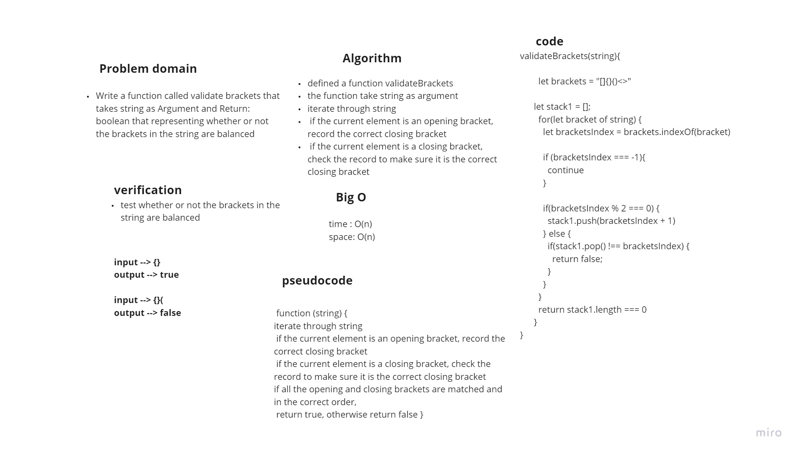

# stack-queue-brackets 

*Write a function called validate brackets that takes string as Argument and Return: boolean that representing whether or not the brackets in the string are balanced*

## Whiteboard Process

## Approach & Efficiency
+ validateBrackets function O(1) space and O(n) time  

## Solution

