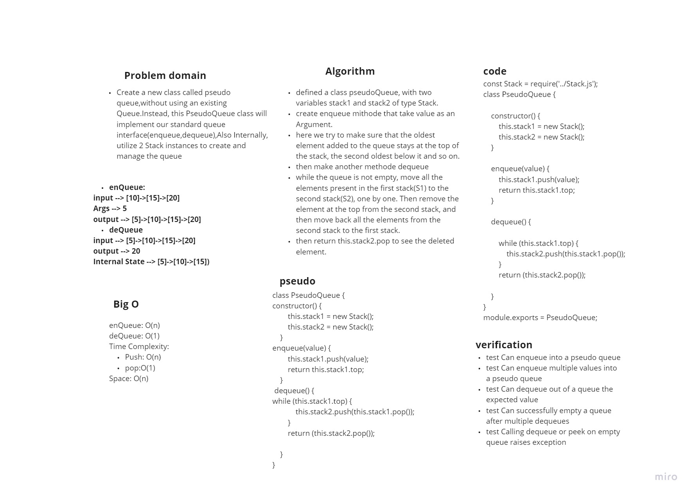
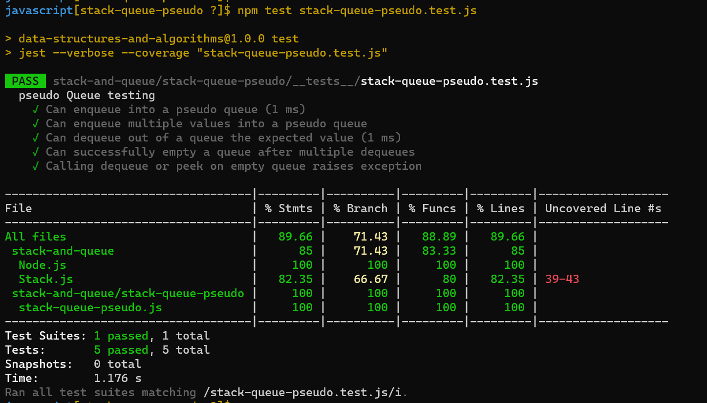

# Challenge Summary
*Create a new class called pseudo queue,without using an existing Queue.Instead, this PseudoQueue class will implement our standard queue interface(enqueue,dequeue),Also Internally, utilize 2 Stack instances to create and manage the queue*

## Whiteboard Process

## Approach & Efficiency

+ enQueue: O(n), *here we try to make sure that the oldest element added to the queue stays at the top of the stack, the second oldest below it and so on.So the push time complexity will be O(n)*

+ deQueue: O(1),*Pop an item from stack1 and return it.So the pop time complexity will be O(1)*

+ the Space will be O(n), use stack for storing values.

## Solution

+ to test if the code is working run ` npm test stack-queue-pseudo.test.js`

+ examples of it in action: 

