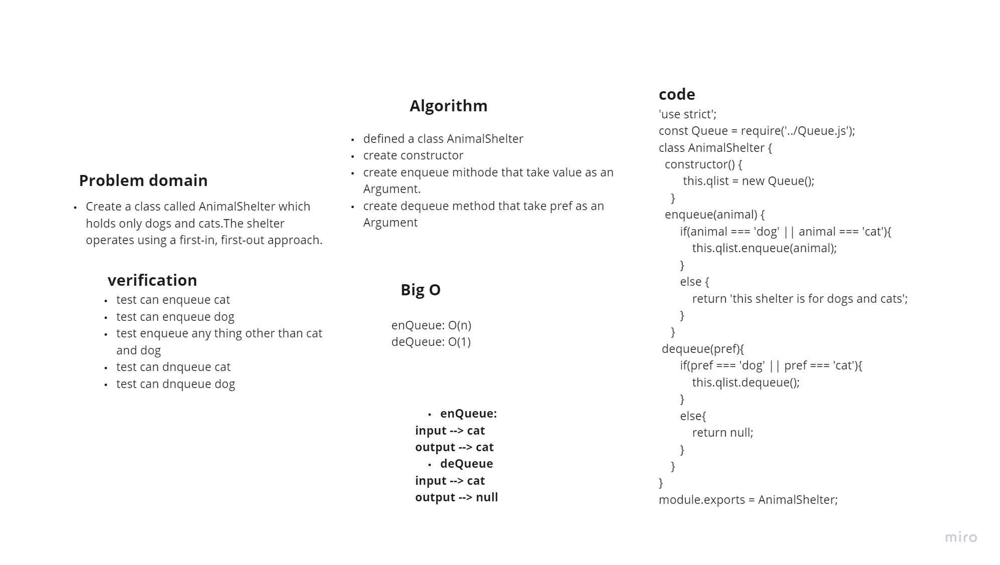
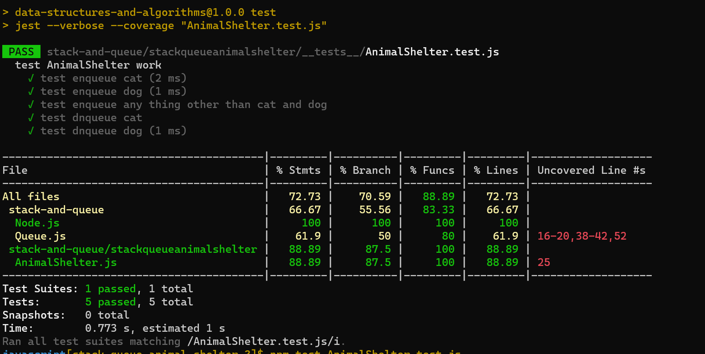

# Challenge Summary

*Create a class called AnimalShelter which holds only dogs and cats.The shelter operates using a first-in, first-out approach.*

## Whiteboard Process

## Approach & Efficiency

+ enqueue, take one Argument(animal),adds a new node with that value to the back of the queue with an O(n) Time performance.
+ dequeue, take one Argument (pref),Removes the node from the front of the queue,O(1)

## Solution

**to run the code use `npm test AnimalShelter.test.js`*

