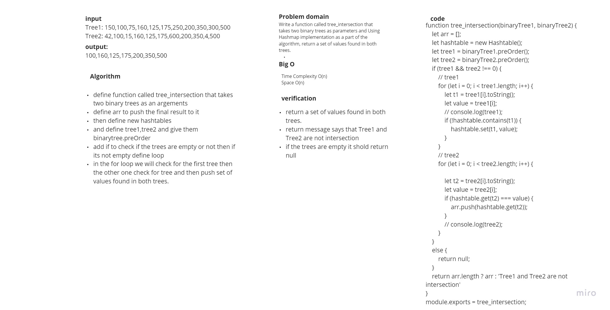
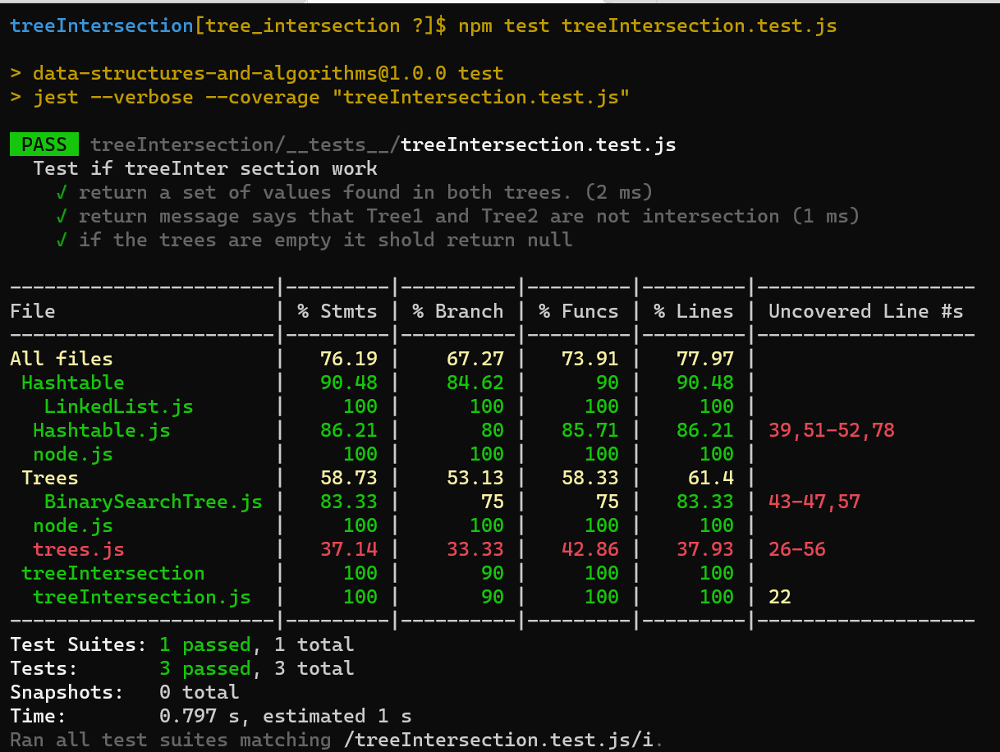

# Challenge Summary
Write a function called tree_intersection that takes two binary trees as parameters and Using  Hashmap implementation as a part of the algorithm, return a set of values found in both trees.

## Whiteboard Process

## Approach & Efficiency
+ Time Complexity O(n)
+ Space Complexity O(n)

## Solution
